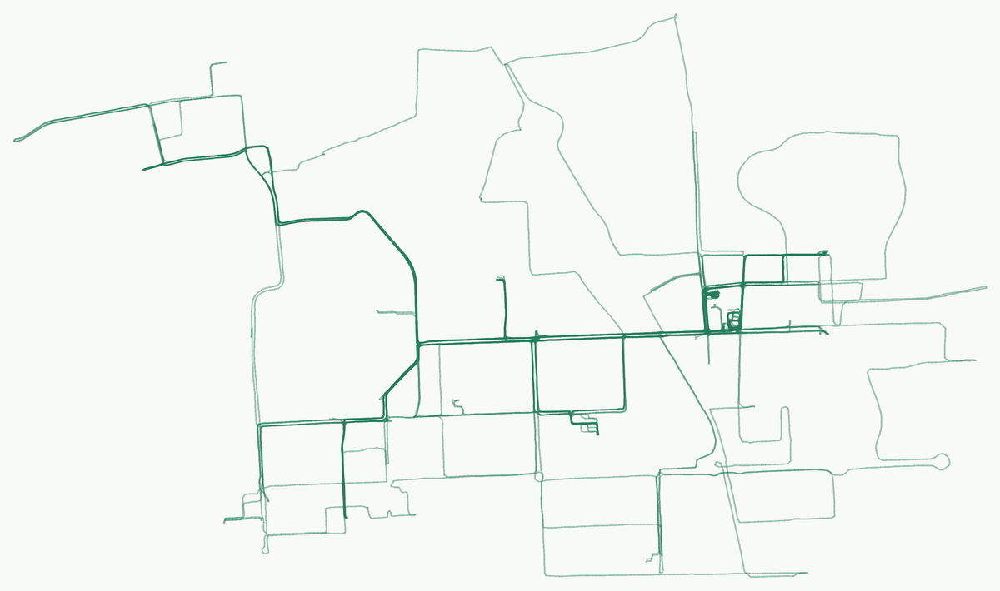

# Along

采集九号骑行数据，在本机查看轨迹地图，导出 CSV 和 JSON，并通过 GitHub Actions 定期同步。

九号官方只提供最近 180 天的详细轨迹数据。

<!-- ninebot-track-image:start -->



<!-- ninebot-track-image:end -->

## 开始使用

安装 [uv](https://docs.astral.sh/uv/getting-started/installation/)，然后在 macOS 或 Linux 终端运行：

```bash
git clone https://github.com/Timisic/ninebot-map.git
cd ninebot-map
./scripts/setup.sh
./run start
```

按提示登录自己的账号、选择车辆和起始月份。脚本配置 Python 3.11+ 环境及依赖，密码隐藏输入。

```bash
./run sync                            # 同步本月并汇总
./run sync --from 202601 --to 202603    # 同步指定月份
./run prepare --all-map-tracks         # 生成全部已保存轨迹的地图数据
./run prepare --map-from 2026-01-01    # 或选择指定日期之后的轨迹
./run map                             # 打开已选车辆或唯一车辆的本地地图
```

地图支持路线叠加、经过区域次数和终点地点列表。页面以 Riding ｜ Running 区分活动，Running 暂未接入数据。后续同步沿用已保存的地图范围。

## 云端同步

先完成首次采集，并登录 [GitHub CLI](https://cli.github.com/)，再运行：

```bash
./run cloud install --publish-repo owner/ninebot-map --publish-repo owner/owner
./run cloud run                       # 立即触发云端同步
./run cloud status                    # 查看状态和下次到期时间
./run cloud map                       # 下载最新档案并打开本地地图
./run cloud pull                      # 下载档案并更新本地地图数据
./run cloud install --interval-days 7 # 修改同步周期
./run cloud disable                   # 停用云端调度
```

默认每 10 天同步一次，GitHub Actions 每天北京时间 10:17 左右检查到期时间。会话和完整历史档案加密保存在独立私有仓库，公开仓库更新轨迹 PNG 和 README 图片。

在本机运行 `cloud map` 或 `cloud pull` 下载最新数据，已打开的地图随后刷新。需要重新登录时，运行 `./run login`、`./run cloud credentials` 和 `./run cloud run`。

## 查看地图与静态导出

```bash
./run map --dataset /path/to/dataset.json
./run map --dataset tests/fixtures/synthetic-map.json --no-open
```

地图会自动打开浏览器，默认地址为 `http://127.0.0.1:8765/`。保留终端运行，按 Ctrl-C 关闭服务。没有可用标准数据时，先运行采集或云端下载。网页不再提供手动导入。

地图统一使用原始坐标。“图层”只保留道路底图和经过次数两个开关。默认无底图，开启道路底图后叠加道路预览。

会话存于 `.private/`，采集档案存于 `data/`，两个目录均由 Git 忽略。曾在 macOS 安装本机定时同步时，程序可能将它们移到 `~/Library/Application Support/Ninebot Map/<标识>/`，并在项目里保留符号链接。终端显示这个路径属于本地保存，不是云端上传。仍可在项目根目录运行 `./run map`。详见[本地存储说明](docs/operations.md#本地存储与地图入口)。

[项目文档](docs/README.md) · [地图说明](docs/map-viewer.md) · [MIT License](LICENSE)

导出静态网站使用 `./run export-site --dataset /path/to/dataset.json --output /path/to/new-site`。公开数据仅含地图展示字段，部署与自动更新见[静态部署说明](docs/static-deployment.md)。

## 未来计划

- 地方时间线：将奥森多入口视作同一地方，积累更多到访后按月查看频次、入口变化和停车停留推算时长；少量样本不解读为趋势。
- 活动节奏：用已有轨迹时间戳观察清晨、白天、夜晚及月份间的变化，不猜出行目的。

遵循宁静技术，自动使用已有记录，不要求手动打卡；数据不足时留白。以上为待办计划，尚未实现。
